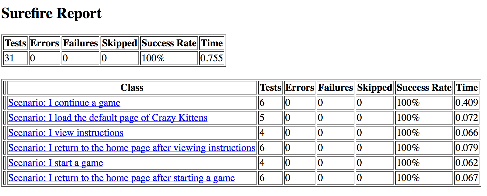

## [Crazy Kittens](../page-0/README.md) >> [Page 23 Chapter 2](../page-23/README.md) >> Page 74 Chapter 3

More unit tests is good, right?

Well, yeah ... but .... 

Your team has now spent 2 rainbows of effort on unit testing alone, and have also chosen to delay resolving the design issues that were identified in the previous step.  There are no higher level tests, still, and the unit tests that have been written now still cover just the one large function.  This area, while not covered better with unit tests, is still tricky to debug, and still fails to show value to the business owners, who find that when they run the app, they feel like they run into situations like this one:

[2 unit tests, 0 integration tests](https://michelenasti.com/images/unit-testing-1.gif)

Your entire team has been eaten by a [Grue](https://en.wikipedia.org/wiki/Grue_(monster)).

    
click here to view <b>Test Results</b>

    

    
click here to view <b>Execution command</b>

    ./execute.sh

To try again: [turn to page 23](../page-23/README.md)

