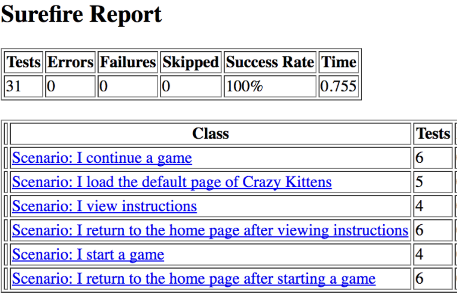

## [Crazy Kittens](../page-0/README.md) >> [Page 23 Chapter 2](../page-23/README.md) >> Page 13 Chapter 3

Refactor, Refactor, Refactor!

The team managed to convince the owners that the code should be refactored NOW, before this team gets any bigger and their beautiful killer app explodes into the marketplace as they are hoping.

With cleaner code, issues that are found can be pinned down much more quickly, scoped to just the small unit being tested by that particular unit test.  As new developers come in, they will be able to lern what the code is doing more quickly and begin to contribute earlier in their onboarding.  Covering more of the lower level functions in unit tests will also help to ensure that future bug fixes and new features do not break exisitng software. Unit tests are small and very short and the feedback loop is very, very fast (seconds as most, usually).

There are drawbacks to spending these 2 rainbows of effort on unit tests as well.  The owners are now feeling even less certain about the value of spending 2 expensive rainbows on something that they have not yet seen the value of, only promises of value.  

Any testers are still working a bit disjointed from those writing the production code, in this case, mostly manually through the UI of the application after new code is pushed to them.  Testing in an automated fashion is not yet being done at a higher level at all, and any bugs that exist in the UI, or through user-level workflow or use of the app, are not caught by these unit tests.

The team did not know it, but while working down this path, the owners had a demo with a very important client, and they lost that client because they were unable to show them the results of tests that the client could understand.

You still have a job, but your Christmas bonus is now gone ... your kid will be splitting beans for their holiday dinner .... ;)

    
click here to view <b>Test Results</b>

    

    
click here to view <b>Execution command</b>

    ./execute.sh

To try again: [turn to page 23](../page-23/README.md)
